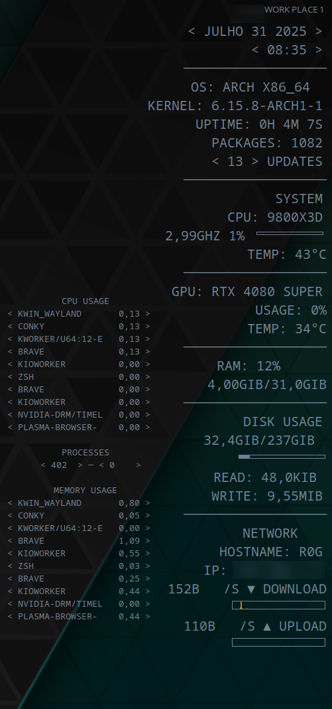

# Conky




# Conky System Monitor Config

This is a custom Conky configuration to display system information in a minimal, organized way.  
It shows date, time, OS, kernel, uptime, packages, updates (using Pacman), CPU, GPU, RAM, disk usage, network info, and running processes.

---

## 📌 Requirements

- **Conky** must be installed.

### 📦 Installation

**Arch Linux / Manjaro / EndeavourOS:**

```bash
sudo pacman -S conky
```

**Ubuntu / Debian:**

```bash
sudo apt update
sudo apt install conky-all
```

**Fedora:**

```bash
sudo dnf install conky
```

---

## 📁 Setup

1. Go to your user config folder:

   ```bash
   cd /home/user/.config
   ```

2. Create a `conky` directory if it does not exist:

   ```bash
   mkdir -p /home/user/.config/conky
   ```

3. Place your Conky config file(s) in `/home/user/.config/conky/`.  
   Example:
   - `conky.conf`
   - `conky-small.conf`
   - `conky-start.sh`

4. Edit the config file to match your hardware:
   - **CPU** name
   - **GPU** name
   - Frequencies, core counts, etc.
   - Adjust any manual labels if needed

   > ⚙️ The update count is based on `pacman`. If you use another package manager, edit the update command accordingly.

---

## ▶️ Running Conky

Instead of running Conky manually, use the included `conky-start.sh` script:

```bash
./conky-start.sh &
```

To start Conky automatically on boot:

1. Make the script executable:

   ```bash
   chmod +x conky-start.sh
   ```

2. Add `conky-start.sh` to your desktop environment’s **Startup Applications** or **Autostart** folder.

---

## 🎨 Customize

- **Font size**, **color**, and **width** can be adjusted directly in each `.conf` file.
- Tweak `gap_x` and `gap_y` to change placement on your screen.
- Change fonts and colors to match your desktop theme.

---

## 📝 Notes

- The hardware info is manually labeled to avoid mismatches.
- For automatic detection, adjust the config to use `hwmon` or `lmsensors` directly.
- By default, this is set for Pacman-based systems. Change the update command for other package managers.
